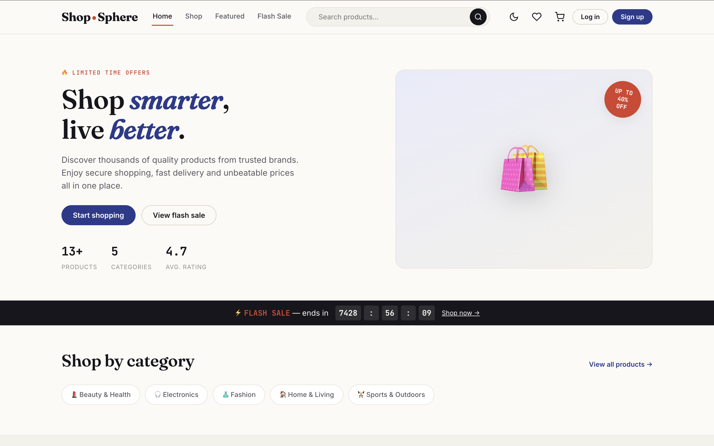
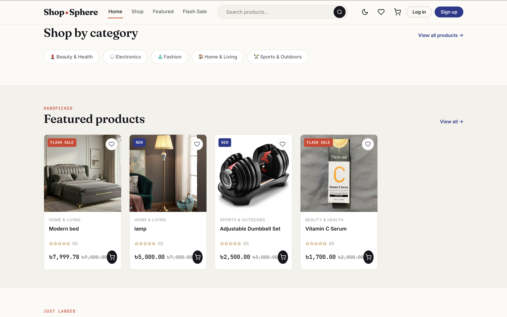
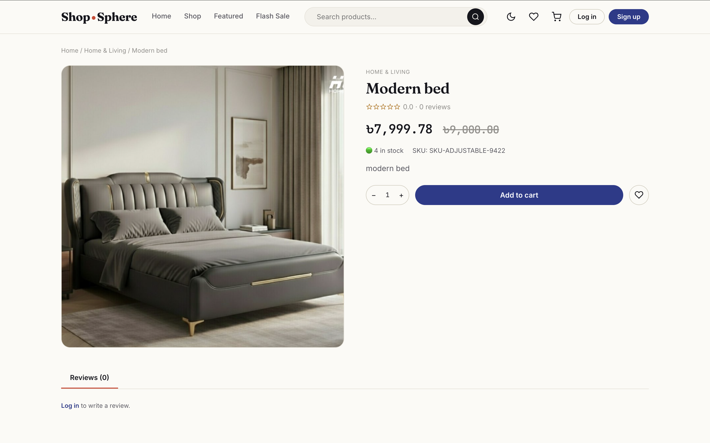
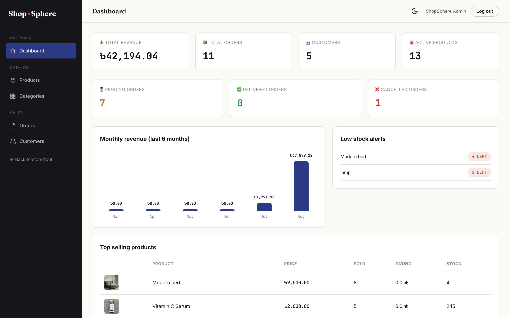
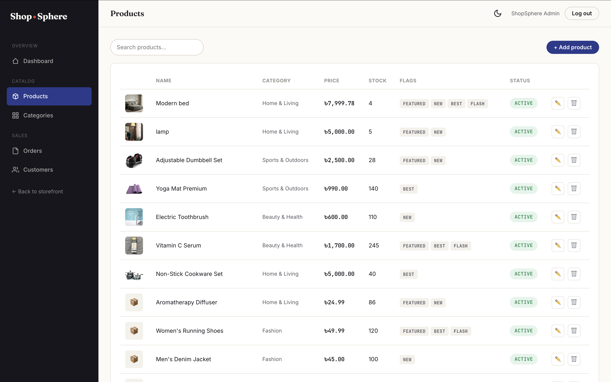

# 🛒 ShopSphere

A modern full-stack e-commerce platform  built with **NestJS**, **PostgreSQL**, **Prisma ORM** and a
lightweight vanilla **HTML/CSS/JavaScript** storefront + admin panel.

<p align="center">
  
  
  
  
  
  
</p>

<p align="center">
  <a href="https://shopsphere.ishrakahmad.me/">
    
  </a>
  &nbsp;
  <a href="https://shopsphere-production-0c6e.up.railway.app/">
    
  </a>
</p> 
# 🔗 Live Demo

https://shopsphere.ishrakahmad.me/


## 📖 Overview

ShopSphere is a complete e-commerce system covering the full customer journey  browsing, cart,
checkout and order tracking alongside a full admin back office for managing products, categories,
orders and customers. It was built to practice production grade patterns: relational schema design,
role based JWT authentication, file uploads to cloud storage and a REST API documented with Swagger.

## ✨ Features

### Customer-facing
- 🔐 **Authentication** — Register, login, forgot/reset password (email-based), JWT sessions
- 🏠 **Home** — Hero banner, category browser, featured/new-arrival/best-seller/flash-sale sections with a live countdown
- 🔍 **Shop** — Full-text search, filter by category/price/rating, sort, pagination
- 📦 **Product details** — Multi-image gallery, star ratings, verified-purchase reviews, related products
- 🛒 **Cart** — Quantity control, save-for-later, coupon codes, live subtotal/shipping/total
- ❤️ **Wishlist**
- 💳 **Checkout** — Address book, Cash-on-Delivery order placement
- 📜 **Orders** — Order history, printable invoice, cancellation
- 🌙 **Dark mode**

### Admin panel
- 📊 **Dashboard** — Revenue KPIs, monthly sales chart, top-selling products, low-stock alerts
- 🛍️ **Product management** — Create/edit/deactivate, multi-image upload (Cloudinary)
- 🗂️ **Category management**
- 📦 **Order management** — Status pipeline (Pending → Processing → Shipped → Delivered / Cancelled)
- 👥 **Customer management** — Search, edit, ban/unban

## 🛠️ Tech Stack

| Layer | Technology |
|---|---|
| Backend | NestJS, TypeScript, class-validator |
| Database | PostgreSQL + Prisma ORM |
| Auth | JWT (Passport), bcrypt password hashing, role-based guards |
| File storage | Cloudinary (product images) |
| Docs | Swagger / OpenAPI |
| Frontend | HTML5, CSS3 (custom design system), vanilla JavaScript (no framework/build step) |
| Email | Nodemailer (Mailtrap for dev) |
| Deployment | Railway (API + PostgreSQL), Vercel (static frontend) |

## 🏗️ Architecture

```
ShopSphere/
├── backend/                 NestJS REST API
│   ├── prisma/               Schema, migrations, seed script
│   └── src/
│       ├── auth/               JWT auth, register/login/reset-password
│       ├── users/               Profile + admin customer management
│       ├── products/             Product CRUD, search/filter, image upload
│       ├── categories/            Category CRUD
│       ├── cart/                   Cart, coupons, totals
│       ├── wishlist/
│       ├── addresses/
│       ├── orders/                 Checkout, order lifecycle
│       ├── reviews/                Verified-purchase reviews
│       ├── admin/                   Dashboard analytics
│       └── common/                  Guards, decorators, filters, DTOs
│
├── frontend/                 Static storefront + admin panel
│   ├── assets/js/              Shared API client, auth, cart, product rendering
│   ├── admin/                    Admin panel pages
│   └── *.html                    Storefront pages
│
└── database/                Schema documentation
```

**Data model** (PostgreSQL, 10+ tables with foreign-key relations): `users`, `categories`, `products`,
`cart` / `cart_items`, `wishlist`, `addresses`, `orders` / `order_items`, `payments`, `reviews`.

## 🚀 Getting Started

### Prerequisites
- Node.js 18+
- PostgreSQL
- A free [Cloudinary](https://cloudinary.com) account (for product image uploads)

### 1. Clone & install
```bash
git clone https://github.com/<your-username>/ShopSphere.git
cd ShopSphere/backend
npm install
```

### 2. Configure environment
```bash
cp .env.example .env
```
Fill in `DATABASE_URL`, `JWT_SECRET`, `JWT_RESET_SECRET`, mail SMTP credentials, and Cloudinary
credentials (`CLOUDINARY_CLOUD_NAME`, `CLOUDINARY_API_KEY`, `CLOUDINARY_API_SECRET`).

### 3. Set up the database
```bash
npx prisma migrate dev --name init
npx prisma db seed
```

### 4. Run the backend
```bash
npm run start:dev
```
API: `http://localhost:5000/api/v1` · Swagger docs: `http://localhost:5000/api/docs`

### 5. Run the frontend
```bash
cd ../frontend
npx http-server -p 3000 -c-1
```
Open `http://localhost:3000/index.html`. If your backend runs on a different port, update
`frontend/assets/js/config.js`.


## 🌐 Deployment

- **Backend + PostgreSQL** — deployed on [Railway](https://railway.app), root directory `backend`
- **Frontend** — deployed as a static site on [Vercel](https://vercel.com), root directory `frontend`
- Set `FRONTEND_URL` on the backend and `API_BASE_URL` in `frontend/assets/js/config.js` to point at
  each other's live URLs for CORS to work correctly.

## 📸 Screenshots

| Home | Product Detail |
|---|---|
|  |  |

| Cart | Checkout |
|---|---|
|  |  |

| Admin Dashboard | Admin Products |
|---|---|
|  |  |

## 🗺️ Roadmap

- [ ] Online payment gateway (SSLCommerz / Stripe) alongside Cash on Delivery
- [ ] React-based frontend rewrite
- [ ] Email verification on signup
- [ ] Automated tests (unit + e2e)

## 📄 License

This project is available for portfolio and educational use.

---

<p align="center">
  <a href="https://github.com/ishrakahmad">
    
  </a>
  <a href="https://www.linkedin.com/in/ishrakahmad/">
    
  </a>
</p>
